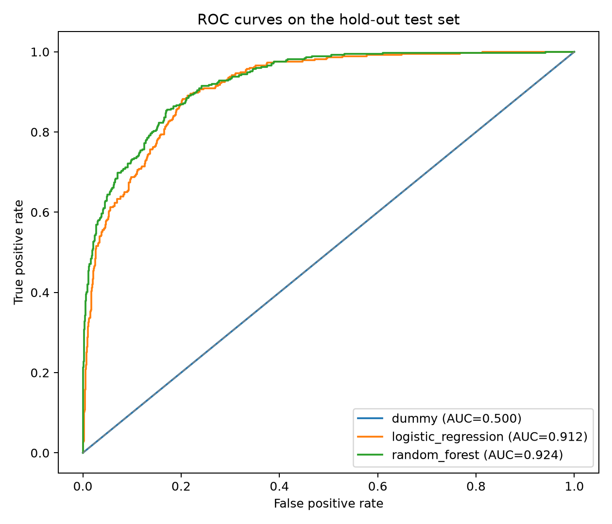
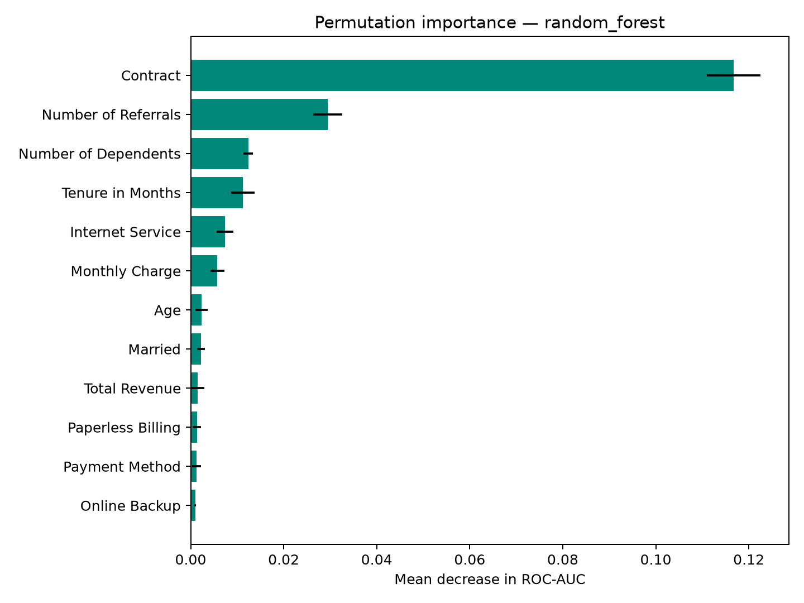
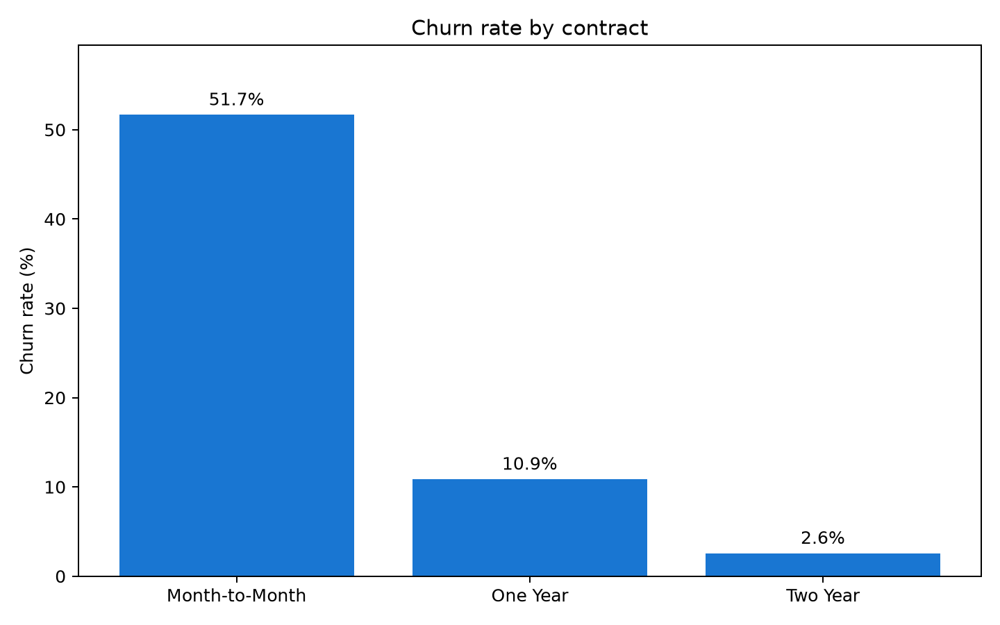

# Telecom Customer Churn: leakage-safe modeling

End-to-end analysis of **6,589 established telecom customers** to identify churn risk without using information that becomes available only after a customer leaves.

This is a corrected and reproducible reconstruction of an academic project by **Aaron Fernández Pinto López**. It combines data integration, exploratory analysis, preprocessing, model comparison and business-oriented evaluation.

## Why this reconstruction matters

The first academic notebook mixed the three-class customer status with a binary classification task and retained outcome-derived variables. That produced optimistic metrics that would not generalize to a real retention workflow.

This version fixes the methodology:

- defines churn explicitly as `Customer Status == "Churned"`;
- compares only established customers (`Stayed` vs. `Churned`) and excludes 454 newly joined customers;
- removes `Customer Status`, `Churn Category` and `Churn Reason` from the predictors;
- removes direct identifiers and high-cardinality location fields;
- joins ZIP-code population as a reproducible enrichment feature;
- fits imputers, scaling and one-hot encoding inside each training fold;
- selects the final model using five-fold ROC-AUC on the training split;
- reports untouched hold-out metrics, a confusion matrix and permutation importance.

## Project structure

```text
data/raw/                  Public-domain Maven Analytics CSV files
src/churn_pipeline.py      Reproducible training and reporting pipeline
tests/                     Data-contract and leakage tests
reports/                   Generated metrics and visualizations
DATA_SOURCE.md             Attribution and license note
```

## Run locally

```powershell
python -m venv .venv
.venv\Scripts\Activate.ps1
pip install -r requirements.txt
pytest
python -m src.churn_pipeline
```

The pipeline writes the following artifacts to `reports/`:

- `metrics.csv`
- `run_summary.json`
- `feature_importance.csv`
- `roc_curves.png`
- `confusion_matrix.png`
- `feature_importance.png`
- `churn_by_contract.png`

The trained `joblib` artifact is generated locally and intentionally ignored by Git.

## Verified results

The reproducible run uses 5,271 training rows and an untouched stratified test set of 1,318 customers.

| Model | CV ROC-AUC | Test ROC-AUC | Precision | Recall | F1 |
|---|---:|---:|---:|---:|---:|
| Random Forest | 0.930 | 0.924 | 0.748 | 0.722 | 0.735 |
| Logistic Regression | 0.915 | 0.912 | 0.633 | 0.866 | 0.731 |
| Prior baseline | 0.500 | 0.500 | 0.000 | 0.000 | 0.000 |

Random Forest wins the predefined cross-validation rule and offers the strongest overall discrimination. Logistic Regression finds more churned customers at the default threshold, illustrating the operational trade-off between recall and false alerts.





## Business findings

- Month-to-month customers show a **51.7%** churn rate, compared with **10.9%** for one-year contracts and **2.6%** for two-year contracts.
- Contract type is the dominant permutation-importance feature, followed by referrals, dependents, tenure, internet service and monthly charge.
- These are predictive associations, not causal effects. A retention team should test contract incentives and onboarding interventions through controlled experiments.



## Data

The data describe a fictional telecommunications company and 7,043 California customers. Maven Analytics lists the data as **Public Domain** and attributes its source to IBM Cognos Analytics. See [DATA_SOURCE.md](DATA_SOURCE.md).

No Telnor data, credentials, institutional account details or private customer records are used in this repository.

## Responsible interpretation

This is a portfolio and educational project. Model scores estimate association within a public sample; they do not prove causation or justify automated decisions about real customers. Retention actions should be tested through controlled experiments and monitored for disparate impact.

---

<details>
<summary><b>Español</b></summary>

<br>

# Abandono de clientes de telecomunicaciones: modelado sin fuga de información

Análisis integral de **6,589 clientes establecidos de telecomunicaciones** para identificar el riesgo de abandono sin usar información disponible únicamente después de que un cliente se da de baja.

Esta es una reconstrucción corregida y reproducible de un proyecto académico de **Aaron Fernández Pinto López**. Combina integración de datos, análisis exploratorio, preprocesamiento, comparación de modelos y evaluación orientada al negocio.

## Por qué importa esta reconstrucción

El primer notebook académico mezclaba el estado del cliente de tres clases con una tarea de clasificación binaria y conservaba variables derivadas del resultado. Eso produjo métricas optimistas que no se generalizarían a un flujo real de retención.

Esta versión corrige la metodología:

- define el abandono explícitamente como `Customer Status == "Churned"`;
- compara únicamente clientes establecidos (`Stayed` frente a `Churned`) y excluye 454 clientes recién incorporados;
- elimina `Customer Status`, `Churn Category` y `Churn Reason` de los predictores;
- elimina identificadores directos y campos de ubicación de alta cardinalidad;
- integra la población por código postal como característica de enriquecimiento reproducible;
- ajusta imputadores, escalado y codificación one-hot dentro de cada fold de entrenamiento;
- selecciona el modelo final usando ROC-AUC de cinco folds sobre la división de entrenamiento;
- reporta métricas de hold-out intactas, una matriz de confusión e importancia por permutación.

## Estructura del proyecto

```text
data/raw/                  Archivos CSV de dominio público de Maven Analytics
src/churn_pipeline.py      Pipeline reproducible de entrenamiento y reportes
tests/                     Pruebas de contrato de datos y fuga de información
reports/                   Métricas y visualizaciones generadas
DATA_SOURCE.md             Nota de atribución y licencia
```

## Ejecución local

```powershell
python -m venv .venv
.venv\Scripts\Activate.ps1
pip install -r requirements.txt
pytest
python -m src.churn_pipeline
```

El pipeline escribe los siguientes artefactos en `reports/`:

- `metrics.csv`
- `run_summary.json`
- `feature_importance.csv`
- `roc_curves.png`
- `confusion_matrix.png`
- `feature_importance.png`
- `churn_by_contract.png`

El artefacto entrenado `joblib` se genera localmente y se excluye intencionalmente de Git.

## Resultados verificados

La ejecución reproducible usa 5,271 filas de entrenamiento y un conjunto de prueba estratificado e intacto de 1,318 clientes.

| Modelo | ROC-AUC CV | ROC-AUC de prueba | Precisión | Recall | F1 |
|---|---:|---:|---:|---:|---:|
| Random Forest | 0.930 | 0.924 | 0.748 | 0.722 | 0.735 |
| Regresión Logística | 0.915 | 0.912 | 0.633 | 0.866 | 0.731 |
| Baseline previo | 0.500 | 0.500 | 0.000 | 0.000 | 0.000 |

Random Forest gana según la regla predefinida de validación cruzada y ofrece la discriminación general más fuerte. La Regresión Logística encuentra más clientes que abandonan con el umbral predeterminado, lo que ilustra el intercambio operativo entre recall y alertas falsas.


## Hallazgos de negocio

- Los clientes mes a mes muestran una tasa de abandono de **51.7%**, frente a **10.9%** en contratos de un año y **2.6%** en contratos de dos años.
- El tipo de contrato es la característica dominante en importancia por permutación, seguido de referidos, dependientes, antigüedad, servicio de internet y cargo mensual.
- Estas son asociaciones predictivas, no efectos causales. Un equipo de retención debería probar incentivos de contrato e intervenciones de incorporación mediante experimentos controlados.


## Datos

Los datos describen una empresa ficticia de telecomunicaciones y 7,043 clientes de California. Maven Analytics clasifica los datos como **Public Domain** y atribuye su fuente a IBM Cognos Analytics. Consulta [DATA_SOURCE.md](DATA_SOURCE.md).

En este repositorio no se utilizan datos de Telnor, credenciales, detalles de cuentas institucionales ni registros privados de clientes.

## Interpretación responsable

Este es un proyecto educativo y de portafolio. Las puntuaciones de los modelos estiman asociaciones dentro de una muestra pública; no demuestran causalidad ni justifican decisiones automatizadas sobre clientes reales. Las acciones de retención deben probarse mediante experimentos controlados y monitorearse para detectar impactos desiguales.

</details>
